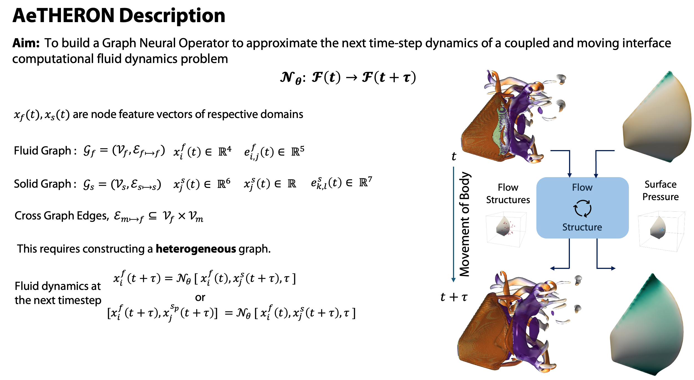

# Coupled FSI Training

This repository contains the implementation of a coupled Fluid-Structure Interaction (FSI) model using Graph Neural Operators (GNO). The project focuses on preprocessing simulation data, training a neural FSI model, and verifying its performance.

## Project Structure
- `src/`: Source code
  - `model/`: Neural FSI model and operators
  - `dataloader/`: Data loading and preprocessing scripts
  - `training/`: Training and evaluation scripts
- `data/`: Simulation metadata and datasets
- `logs/`: Training logs and model checkpoints
- `utils/`: Utility scripts and best model weights
- `notebooks/`: Jupyter notebooks for exploration

## Installation
1. Clone the repository:
   ```bash
   git clone https://github.com/sushrutkr/aetheron.git
   cd NeuralOpt_FSI/
2. Setup Environment
   conda env create -f ./utils/NeuralFSIEnv.yml
3. Run model of distributed cluster
    sbatch job

## Model Visual Overview

### Contour Plot 1


